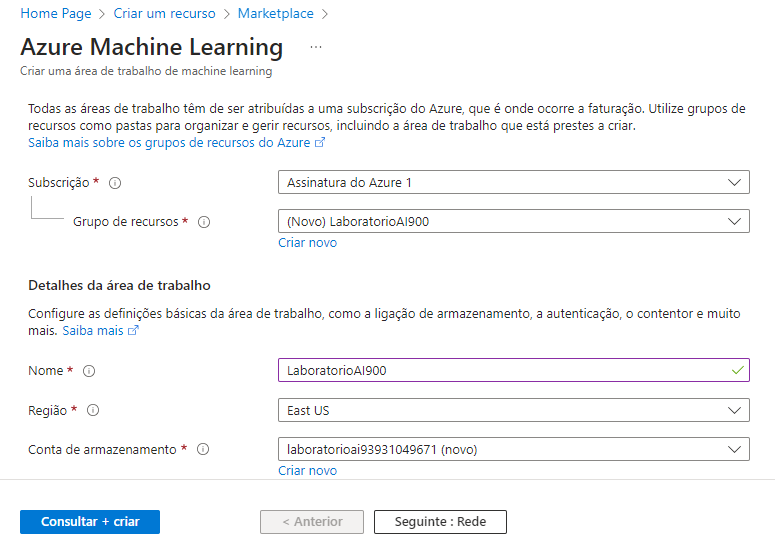
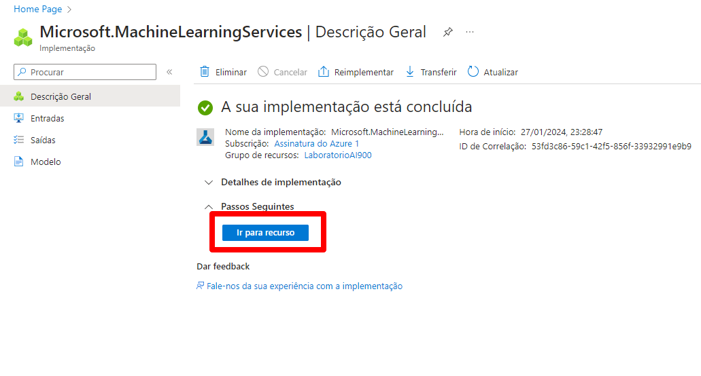
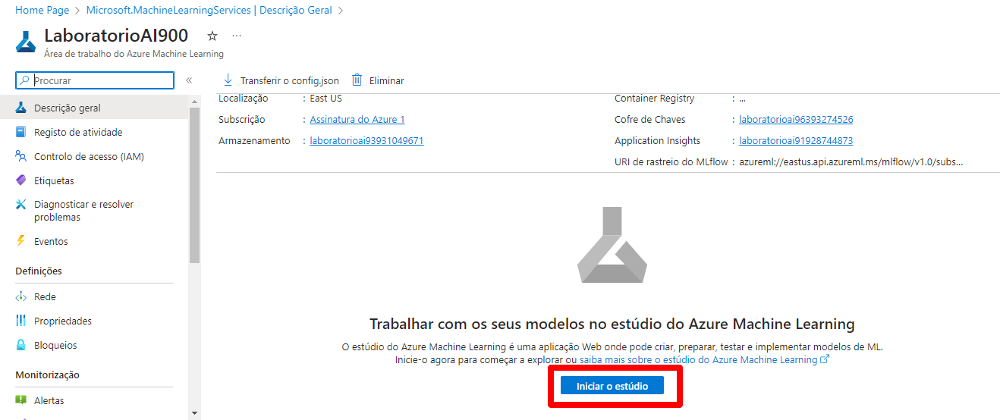
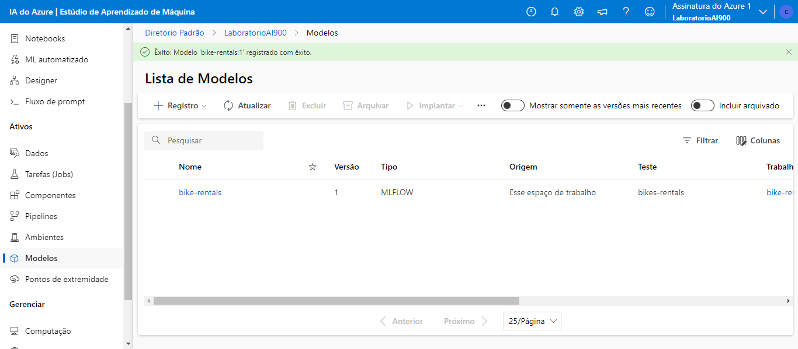
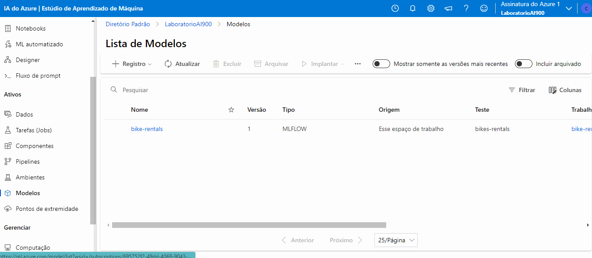

# Azure ML
## Passo a passo do Desafio da DIO de criar um modelo de ML no Azure ML.

 

## 01 - Acessando o recurso do Azure Machine Learning

Após configurar a conta no Azure o próximo passo é criar um recurso de Machine Learning.

Na homepage clique na opção "*Criar um recurso*", depois em pesquisar por **Azure Machine Learning**, e após isto clicar no ícone para criar o recurso.

 

### 02 - Configuração do o Azure Machine Learning

No painel intitulado "*Noções Básicas*", na seção "*Detalhes do Recurso*", deve ser inserida a assinatura correspondente à cobrança no campo designado como "*Assinatura*". Posteriormente, especificar o "*Grupo de Recursos*" que irá incorporar o recurso a ser criado.

Em seguida, na seção "*Detalhes da Área de Trabalho*", deve-se fornecer os detalhes do espaço de trabalho a ser estabelecido. 

O recurso é criado ao selecionar a opção "*Consultar + Criar*". Após a aprovação da validação, clique em "*Criar*".

 

Criado o recurso, clique no botão "*Ir para o Recurso*",direcionando à página correspondente ao recurso.

Conforme a imagem abaixo, há o botão"*Iniciar o Estúdio*", que  redireciona ao estúdio do **Azure Machine Learning**. 

 

### 03 - Acessando o estúdio do Azure ML

Acessando o *estúdio Azure ML*, clique na opção "ML Automatizado" no menu à esquerda. Na página seguinte, clique na opção "Novo Trabalho de ML Automatizado". Como mostra abaixo:

Na seção "Configurações Básicas", preencha os campos "Nome do Trabalho", "Novo Nome do Experimento", "Descrição" e clique em "Avançar".

Em seguida, na opção "Tipo de Tarefa e Dados", selecione a tarefa do tipo "Regressão". Após, clique em "Selecionar Dados", e em seguida no botão "Criar". Na janela seguinte, na seção "Tipos de Dados", preencha os campos "Nome", "Descrição" e em "Tipo" definina-o como Tabular. Em seguida clique em "Avançar".

 

### 04 - Ingestão de dados

Na parte "*Fonte de Dados*", escolha a opção "De Arquivos da Web" e clique em "Avançar".

No passo "*URL da Web*", informe a URL: https://aka.ms/bike-rentals correspondente ao conjunto de dados usado. No passo "*Configurações*", preencha as configurações do conjunto, na opção "Esquema", verifique os tipos de dados. Clicando em "Avançar", cheque as configurações criadas para o ativo de dados e em seguida clique no botão "Criar".

Na seção "*Configurações de Tarefas*", selecione o conjunto de dados previamente importado. Posteriormente, na opção "Coluna de Destino", escolha a coluna "rentals" como alvo.

Na seção "*Limite*", foram insera os valores conforme indicado na imagem abaixo. Após ative a opção "*Habilitar Encerramento Antecipado*".

 

### 05 - Validação do modelo

Na página "*Validar e testar*", na opção "*Tipo de validação*", escolha "*Divisão de validação de treinamento*".

Ao avançar, em "*Computação*", manter os valores informados no print:

Clique em "*Avançar*" e verifique as configurações do trabalho, clique em "*Enviar trabalho de treinamento*".

Ao finalizar o trabalho de treinamento, o modelo ficou disponível na opção do menu esquerdo "*Modelos*".

 

### 06 - Análise das Métricas do modelo

Para acessar as métricas do modelo treinado, na página do modelo acesse o link disponibilizado com o nome do trabalho criado. Como mostra abaixo:

 

### 07 - Teste do modelo

No menu a esquerda, clique em "Pontos de extremidade" e selecionei o ponto correspondente ao modelo gerado. Em seguida acesse a aba "Testar".

Para esse teste foi utilizado o json abaixo:

<code>
{
  "input_data": {
    "data": [
       {
         "day": 1,
         "mnth": 1,   
         "year": 2022,
         "season": 2,
         "holiday": 0,
         "weekday": 1,
         "workingday": 1,
         "weathersit": 2, 
         "temp": 0.3, 
         "atemp": 0.3,
         "hum": 0.3,
         "windspeed": 0.3 
       }
     ]
  }
}

</code>

 

A previsão do modelo: 361.95.  
Print com o resultado:

 

### *Referências*:

- Explore Automated Machine Learning in Azure Machine Learning - [*Microsoft Learn*](https://microsoftlearning.github.io/mslearn-ai-fundamentals/Instructions/Labs/01-machine-learning.html)

- [Fonte de dados](https://raw.githubusercontent.com/MicrosoftLearning/mslearn-ai-fundamentals/main/data/ml/daily-bike-share.csv)
